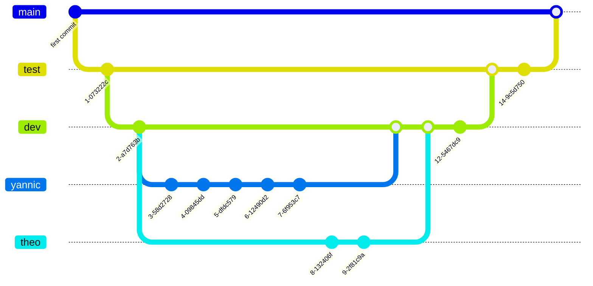

## mise en forme

- branche master(prod) reste clean
- branche test (pre-prod)
- branche dev (dev-local)



- Exemple de commande git pour un nouveau projet

```shell
# Initialise un nouveau dépôt Git dans le répertoire actuel.
git init

# Ajoute tous les fichiers modifiés au prochain commit.
git add .

# Commit les changements ajoutés avec un message de commit "First commit".
git commit -a -m "First commit"

# Ajoute un dépôt distant nommé "origin" avec l'URL spécifiée.
git remote add origin https://blablabla

# Renomme la branche actuelle en "master".
git branch -M master

# Pousse la branche "master" locale vers le dépôt distant nommé "origin".
git push -u origin master

# Crée une nouvelle branche appelée "dev".
git branch dev

# Change de branche pour "dev".
git checkout dev

# Crée une nouvelle branche nommée "yannic" et bascule vers cette branche.
git checkout -b yannic
```
